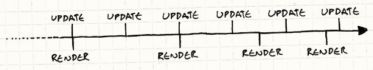
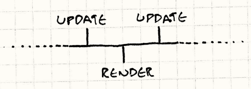

## Problema
Quando crei un gioco, vuoi che questo risulti visivamente uguale ovunque. \
Che si tratti di 600 fps oppure 10, il gioco deve procedere allo stesso ritmo.

Gli utenti però, dispongono di differenti dispositivi con differenti caratteristiche.

Inoltre, anche sulla stessa macchina gli fps potrebbero cambiare drasticamente, in base
a scene più o meno dispendiose di risorse.

## Tempo di gioco e tempo reale
E' chiaro che ci sono due "tempi" diversi che dobbiamo coordinare:
1. Tempo di gioco (a ogni update, il tempo di gioco va avanti di un certo ammontare)
2. Tempo reale (è richiesto un certo ammontare di tempo per processare l'update)

#### Cosa succede quando il gioco rallenta?
Se il punto 2 supera il punto 1 (tempo reale > tempo gioco), il gioco rallenta.\
In altre parole, se a 60 fps il nostro `drawInterval` è 16 ms, e il nostro update impiega più tempo,
il gioco rallenta (perde un fps, quindi da 60 saremo a 59).

Un intero calcolo è stato quindi perso (ho perso un frame di update e repaint).

## Soluzione
Invece di rallentare il gioco, faccio più update nello stesso frame, quindi gli fps passeranno lo stesso a 59, ma
l'update fatto sarà 2 volte quello necessario, recuperando così l'update che avrei precedentemente perso.

In altre parole, ciò a cui miriamo è quello di **far avanzare il gioco in base al tempo realmente trascorso.**\
Più il frame ci mette ad essere eseguito, più il gioco avanzerà nel frame successivo.\

Ciò permetterà al tempo di gioco, di rimanere sempre al passo con il tempo reale (avanzando più o meno largamente
, adattandosi così al tempo reale).

#### RECAP - Cosa voglio ottenere:
Se ho un calo di fps, non voglio che il gioco scorra più lentamente, ma voglio disegnare meno frame, mantenendo
comunque lo stesso impatto dei frame persi.

#### Pseudo codice
```Java
double lastTime = getCurrentTime();
while (true){
    double current = getCurrentTime();
    double elapsed = current - lastTime;
    processInput();
    update(elapsed);
    render();
    lastTime = current;
}
```
In ogni frame, determiniamo quanto tempo è passato rispetto all'ultimo frame (`elapsed`).\
Quando aggiorniamo lo stato del gioco, passiamo tale differenza.\
Sarà poi compito della nostra game engine, utilizzare tale valore per far avanzare correttamente lo stato del gioco.

Per chiudere, invece che aumentare lo stato del gioco a ritmi regolari (fixed time step) lo facciamo tenendo
conto delle differenze di tempo tra i frame (**variable/fluid time step**).

#### Vantaggi ottenuti:
- Il gioco gira a frame consistenti, anche su differenti hardware.
- Il giocatore con la macchina più veloce, sarà ricompensato con un gioco più fluido.

****
## Una soluzione che porti ad altri problemi...
Bene, ora il gioco gira in modo fluido su tutti i pc....\
Siamo purtroppo incappati in un ulteriore problema.

Immaginate due pc che eseguono il nostro gioco:
- Alfred ha un pc potentissimo.
- Tom ha un pc prestatogli dalla nonnina.

Per entrambi, il gioco viene eseguito perfettamente.\
Mentre il pc di Alfred raggiunge i 60 fps tranquillamente, Tom resta fisso sui 5, e nonostante questo, entrambi
i giocatori si godono il medesimo funzionamento.

Senza accorgercene, abbiamo creato un programma non deterministico e instabile!

#### Spiegazione di "deterministico"
Significa che ogni volta che esegui il programma con gli stessi input, 
ottieni esattamente gli stessi output.\
Come puoi immaginare, è molto più facile individuare errori nei programmi deterministici: 
se trovi gli input che hanno causato l'errore la prima volta, puoi farlo verificare ogni volta.

### Problema 1: floating point arithmetic
Ogni operazione con i float (o double), se ripetuta, può produrre risultati leggermente diversi.\
Ciò significa che, se il pc di Alfred gira 10 volte tanto il pc di Tom, il pc di Afred accumulerà 10 volte l'errore
di calcolo, accumulato invece da Tom!

### Problem 2: physics engines
Il motore della fisica, nei videogiochi, si occupa di approssimare le leggi reali della meccanica.\
Per evitare che queste approssimazioni siano errate, viene applicato un **damping** (o smorzamento).\
Tale damping però, è meticolosamente calibrato per un determinato lasso di tempo.\
Se questo lasso di tempo varia, la simulazione può diventare instabile!

### Rendering - ok con variable time step
E' bene notare che il rendering non è effettato dal problema (non determinismo, instabilità) del variable time step.\
Il motivo per cui il rendering ne è immune, è perché il rendering prende "un punto nel tempo" qualsiasi.\
Non è interessato alle differenze tra punti diversi nel tempo.

### Riflettiamo
Come abbiamo detto, l'update è effettato dal problema, mentre il rendering no.\
Possiamo usare la cosa a nostro vantaggio:
- update: fixed time step
- rendering: variable time step

#### Pseudo codice
```Java
double previous = getCurrentTime();
double lag = 0.0;
while (true){
    double current = getCurrentTime();
    double elapsed = current - previous;
    previous = current;
    lag += elapsed;
    
    processInput();

    while (lag >= MS_PER_UPDATE){
        update();
        lag -= MS_PER_UPDATE;
    }
    
    render();
}
```
All'inizio di ogni frame, aggiorniamo la variabile `lag` in base a quanto tempo reale è passato.\
Questo misura quanto il **game's clock** è indietro, rispetto al tempo reale.

Abbiamo poi il loop interno che esegue l'update a tempi regolari (`MS_PER_UPDATE`), e ciò avviene
fino a che il lag non abbia raggiunto `MS_PER_UPDATE` stesso.

**Nota**:
`MS_PER_UPDATE` rappresenta la granularità con cui aggiorniamo il gioco!\
In altre parole, più è un valore piccolo, più il gioco ci metterà tempo a raggiungere il tempo reale.\
Più invece è un valore grande, più il gioco diventerà instabile.

Idealmente, vogliamo `MS_PER_UPDATE` il più piccolo possibile, in modo che il gioco simuli con alta fedeltà, su
macchine veloci.

Ma attenzione a impostare `MS_PER_UPDATE` troppo piccolo. Se il tempo richiesto all'update diventasse
superiore al `MS_PER_UPDATE`, il gioco tempo di gioco si disallineerebbe al tempo reale.

Ora abbiamo fortunatamente guadagnato tempo (e spazio in cui giocarcela) per la CPU.\
Il trick è stato spostare il rendering fuori dal loop in cui è coinvolto l'update.

Risultato:
- Simulazione a tempo fisso.
- Rendering a tempo variabile.

## Anche questa soluzione, porta a un altro problema

\
Come vedete, l'update avviene a ritmi regolari (fixed time step) mentre il rendering avviene causalmente
(variable time step).\
Il problema nasce quando renderizzo esattamente in mezzo a due update.\
\
Immaginiamo questa situazione:\
nel primo update (sinistra) il proiettile è a sinistra dello schermo,\
nel secondo update (destra) il proiettile è a destra dello schermo,\
ma il rendering è solo 1, ed è esattamente in mezzo.

In sostanza l'utente vedrebbe il proiettile saltare tutto lo schermo, da una parte all'altra.

#### Soluzione
Conosciamo quanto lontano, tra gli update, i frame sono.\
Questa informazione è immagazzinata in `lag`.

Quindi, all'update passeremo **lag \ MS_PER_UPDATE**.

Passando tale valore, diremo al render dove esattamente siamo in quel momento.\
Se quindi il render è a metà tra due update (come il problema sopra enunciato) passeremo es. 0.5.\
Questo sistema di correzione non è sempre preciso, ma anche se sbagliasse, non se ne accorgerebbe nessuno...

### Risorse utilizzate
_Ho eliminato tutte le risorse che non hanno impattato in modo concreto lo 
svolgimento dell'analisi sul sistema degli fps._
- [Articolo_1](https://gameprogrammingpatterns.com/game-loop.html)
Questo articolo è stata la base del mio studio soprastante. Non ho mai trovato un documento di tale 
profondità e pragmatismo. L'elenganza dei concetti esposti mi ha ricordato il perché della questione open-source e
del perché diffondere e scambiare conoscenza, per arricchire noi stessi e chi ci sta attorno.
- [YouTube_1](https://www.youtube.com/watch?v=pctGOMDW-HQ&ab_channel=TheCherno)
Spiegazione fixed time step e delta time (c++). E' un buon modo per rendersi conto che "delta time" 
(aka variable time step) e fixed time step, devono essere usati in sincronia per risolvere la maggior parte dei
problemi sugli fps.


