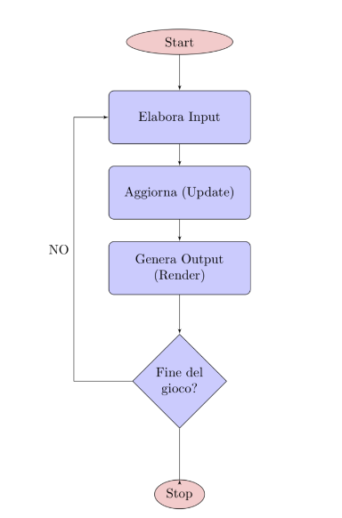

# Il Game Loop
Un "game loop" è un concetto fondamentale nell'ambito dello sviluppo di videogiochi e si riferisce a una struttura ciclica utilizzata per mantenere un gioco in esecuzione.

Gestire gli **input** del giocatore, **aggiornare lo stato del gioco** e **renderizzare le immagini sullo schermo**. La sua funzione principale è quella di assicurare che il gioco sia eseguito in modo continuo e fluido.

Si chiama loop poiché vengono eseguite **iterazioni cicliche** di aggiornamento con una data frequenza, fino a quando l’utente termina il gioco. 

## Iterazioni cicliche nel game loop
Ogni iterazione prepara la visualizzazione di un frame. 
Durante ogni ciclo il game loop legge gli input esterni, aggiorna lo stato degli oggetti e prepara l’immagine della scena da visualizzare.
In genere la frequenza di aggiornamento del frame è di 30 o 60 frame al secondo (fps). 

In un gioco che gira a 30 fps il game loop esegue 30 iterazioni ogni secondo. Se fissiamo la frequenza a 30, allora il tempo per completare l’aggiornamento del frame non deve superare 33.3 millisecondi; se invece fissiamo gli fps a 60, dobbiamo finire l’aggiornamento in 16,6 millisecondi:

```Java
 1 secondo = 1000 millisecondi
   1000/30 = ~33.3 millisecondi
   1000/60 = ~16.6 millisecondi
```

*N.d.A.* \
**I calcoli che ho fornito si riferiscono alla conversione del tempo tra secondi e millisecondi, nonché alla suddivisione di un secondo in frammenti più piccoli, specificamente in 1/30 di secondo e 1/60 di secondo.**

In sintesi, questi calcoli ti aiutano a capire come suddividere il tempo in millisecondi per regolare l'aggiornamento e la renderizzazione del gioco in modo da ottenere una frequenza desiderata, come 30 FPS o 60 FPS.

Vedremo in seguito un esempio di algoritmo tradizionale di base e può essere rappresentato con il seguente diagramma a blocchi:



## Link utili
Per saziare la vostra fame di conoscenza metterò a dispozione dei link utili che riguardano il game loop, da esempi pragmatici e video tutorial utili per il nostro progetto, essendo molto grande e complesso come argomento ho messo a disposizione questo materiale.

Su questo [sito](https://java-design-patterns.com/patterns/game-loop/) troverete a vostra disposozione un'ottima documentazione su esempi pragmatici sul game loop e tutte le sue funzionalità.

Per non farci mancare niente cliccando su questo [video](https://youtu.be/fgxHNPb-7as?si=m8J17VwvtGQr7Y9-) vi reindirizzerà ad un canale Youtube molto interessante che tratta appunto lo sviluppo videogiochi, il video in questione parla del **Game Loop**.


