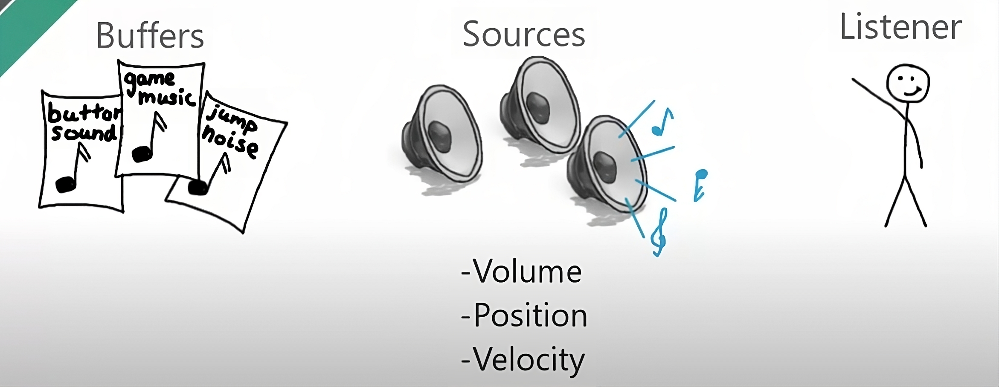

#### Generale
- OpenAL (Open Audio Library) è una libreria che gestisce l'audio nei giochi 2D/3D.
- 

## Oggetti principali


**Buffer**\
Rappresenta un file musicale (.mp3, .waw, ...)

**Source**\
E' un player di buffer.\
Ha delle coordinate x, y, z\
Ha una "velocità" (velocity), che determina la velocità e la direzione in cui il suono viaggia.

**Listener**\
Rappresenta l'entità che ascolta il suono.
Solitamente ce n'é solo una per gioco, e corrisponde al giocatore.

## Codice di esempio
Tutti i costrutti di OpenAL iniziano con `al`.\
Esempio:
- alGenSources()
- alGetError()
- alListener3f()
- AL_POSITION
- AL_LOOPING
- AL_TRUE
```Java
// "gen" significa generatore in OpenAL. Qui stiamo generando una source (aka player).
int sourceID = alGenSources();

// Modifico la posizione del source
alSource3f(sourceID, AL_POSITION, 45f, 5f, -18f);

// Modifica il volume della source
alSource3f(sourceID, AL_GAIN, 0.8f);
```

#### Risorse utilizzate
- Tutorial di Thin Matrix: [qui](https://www.youtube.com/watch?v=BR8KjNkYURk)
- Setup di LWJGL. Libreria di videogiochi contenente OpenAL: [qui](https://github.com/LWJGL/lwjgl3-wiki/wiki/1.2.-Install)