Vediamo come la programmazione a oggetti, si traduce in componenti del diagramma di classe.

### Modificatori di accesso
`+` Pubblico, default\
`-` Privato\
`#` Protetto

### Attributi
[MODIFICATORE DI ACCESSO] [NOME]: [TIPO] = [VALORE]

Esempio:\
`+ bar: int = 17`\
`+ name: String = "Pippo"`\
`- object: Object`

Gli attributi statici sono sottolineati. Purtroppo la sottolineatura non è rappresentabile in markdown.

### Metodi
Pubblici e privati, uguali agli attributi:\
`+ foo1(): void`\
`- foo2(): int`

#### Argomenti dei metodi
Si indicano in relazione al chiamante, come:
- **in**: solo input
- **inout**: input nel metodo, e ritorno al chiamante
- **out**: ritorno al chiamante\

### Classe

### Classe astratta
Uguale alla classe, ma con il nome in corsivo.\

### Classe annidata
Anche se "poco comune", ecco un esempio di classe annidata:\
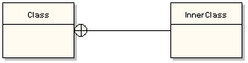

### Ereditarietà (o generalizzazione)
Veicolo è la classe padre di Automobile.\
Automobile è la classe padre di Audi, Ford, ....\

### Interfacce
Si scrivono come le classi, ma prima del nome devi includere "**\<\<interface>>**"\

**Nota:** E' comunque possibile specificare una interfaccia, senza specificarne l'implementazione!

Si implementano con una relazione di realizzazione:\
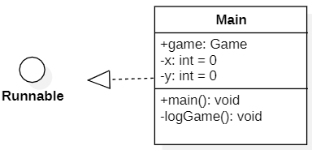

### Relazioni
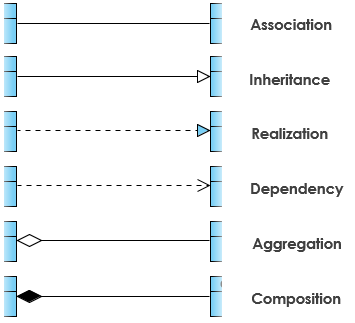

Le due classi hanno visibilità l'una dell'altra.\
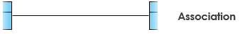

La classe X eredita dalla classe a cui punta.\
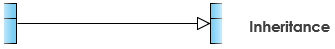

La classe X implementa l'interfaccia a cui punta.\
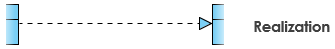

La classe X utilizza o dipende dalla classe a cui punta.\
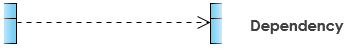

L'esistenza della classe di sinistra NON dipende dalla classe di destra.\
La classe di sinistra quindi è indipendente (es. Motore a dx, Automobile a sx).\
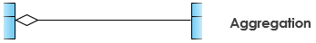

L'esistenza della classe di sinistra dipende dalla classe di destra.\
La classe di sinistra quindi non può esistere senza la classe di destra (es. Mano a dx, Uomo a sx).\
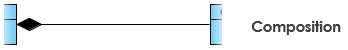

### Cardinalità
Si può esprimere come:
- Uno a uno
- Uno a molti
- Molti a molti\
  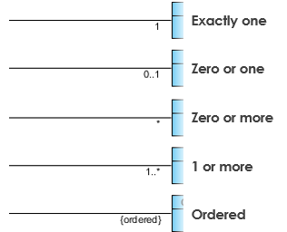

### Ruolo
Esprime come un oggetto partecipa a una relazione.\
Sotto abbiamo che un professore, può scrivere da 0 a più libri.\
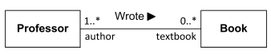\
Il ruolo descrive il Professor come author, e il Book come textbook.

Un altro esempio di ruolo, potrebbe essere un dipendente (Employee) che lavora su diversi progetti, e con diverso ruolo
(title), livello di sicurezza (SecurityLevel) e magari PartTime:
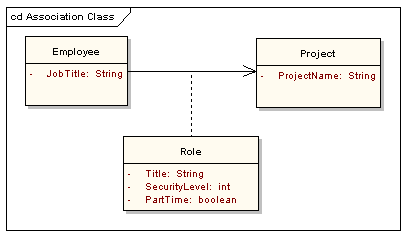

## Esempio completo 1
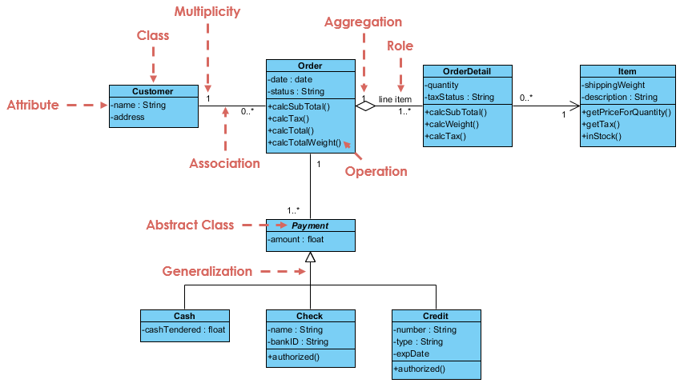

## Esempio completo 2
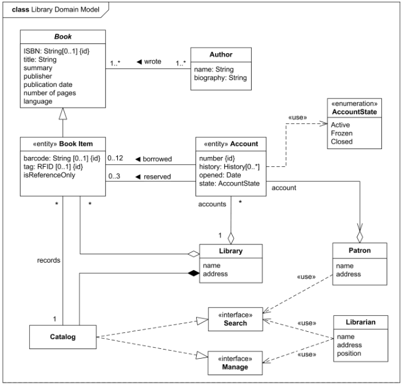

### Note finali
- Lo stesso diagramma, può essere rappresentato secondo piccole differenze estetiche.
  - Lo stesso diagramma ha quindi più "modi" di essere rappresentato.
- Avendo raggruppato diverse fonti, è possibile che qualche dettaglio sia sfuggito. Questo documento\
rappresenta comunque un'ottima base.

### Risorse utilizzate
- [UML Class Diagram in generale](https://sparxsystems.com/resources/tutorials/uml2/class-diagram.html)
- [Interfacce 1](https://www.ibm.com/docs/en/rational-soft-arch/9.7.0?topic=diagrams-interface-realization-relationships)
- [Interfacce 2](https://www.ibm.com/docs/en/dma?topic=diagrams-interfaces)
- [Riassunto base (mancano elementi, ma fa capire a livello base i diagrammi di classe)](https://www.visual-paradigm.com/guide/uml-unified-modeling-language/uml-class-diagram-tutorial/)
- [Ruoli](https://stackoverflow.com/questions/16732607/role-name-in-association-relationship)
