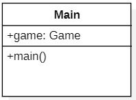
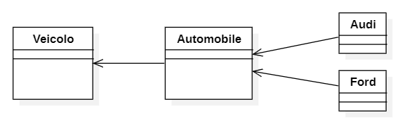

Vediamo come la programmazione a oggetti, si traduce in componenti del diagramma di classe.

### In generale
#### Modificatori di accesso
`+` Pubblico\
`-` Privato\
`#` Protetto

#### 

#### Attributi
[MODIFICATORE DI ACCESSO] [NOME]: [TIPO] = [VALORE]\
Esempio:\
`+ BAR: int = 17`\
`+ NAME: String = "Pippo"`\
`- object: Object`

### Classe
La classe Main, con un attributo pubblico `game` di tipo `Game`.\
Vi è inoltre un metodo `main` pubblico.

### Ereditarietà
Veicolo è la classe padre di Automobile.\
Automobile è la classe padre di Audi, Ford, ....

### Interfacce

### Aggregazione

### Composizione

Vediamo un esempio improntato alla versione del nostro gioco, del 30/10/2023:

### Risorse utilizzate
- [Articolo 1](https://sparxsystems.com/resources/tutorials/uml2/class-diagram.html)
- [Interfacce](https://www.ibm.com/docs/en/rational-soft-arch/9.7.0?topic=diagrams-interface-realization-relationships)